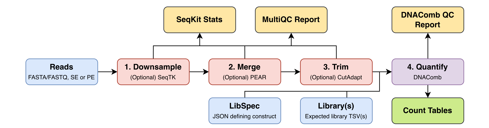

# DNAComb read processing pipeline



A simple configurable Nextflow pipeline for initial processing of sequence reads in count tables using [DNAComb](https://github.com/allydunham/dnacomb).
The pipeline applies a series of optional transformations to input fasta/fastq(.gz) files:

1. Downsampling with [SeqTK](https://github.com/lh3/seqtk)
2. Merging with [PEAR](https://cme.h-its.org/exelixis/web/software/pear/doc.html)
3. Trimming with [CutAdapt](https://cutadapt.readthedocs.io/en/stable/)
4. Quantification with [DNAComb](https://github.com/allydunham/dnacomb)
5. Quantification QC

Each stage can be enabled/disabled and configured to apply the desired transformation and quantification, allowing easy processing of either single or paired end reads of a wide range of structures.
Additionally the fastq/a files at each stage are checked with [SeqKit Stats](https://bioinf.shenwei.me/seqkit/) and [FastQC](https://github.com/s-andrews/FastQC) and a combined report generated by [MultiQC](https://github.com/MultiQC/MultiQC).

## Requirements

The pipeline relies on [Nextflow](https://www.nextflow.io) (>=25.04) and has a number of other dependencies, which can be installed locally or accessed via our container using Docker, Singularity or Apptainer.
These can be accessed using the `-with-singularity` or `-with-docker` Nextflow arguments.
If installing locally, the following tools are required:

- [DNAComb](https://github.com/allydunham/dnacomb)
- [SeqTK](https://github.com/lh3/seqtk)
- [PEAR](https://cme.h-its.org/exelixis/web/software/pear/doc.html)
- [CutAdapt](https://cutadapt.readthedocs.io/en/stable/)
- [MultiQC](https://github.com/MultiQC/MultiQC)
- [FastQC](https://github.com/s-andrews/FastQC)
- [SeqKit](https://bioinf.shenwei.me/seqkit/)
- R (>=4.0.0)
- Python (>=3.11.0)

The following R packages are needed:

- argparser
- magrittr
- tidyverse
- ggpubr
- ggtext
- patchwork
- rmarkdown
- knitr
- kableExtra

## Usage

The easiest way to run the pipeline is:

```bash
nextflow run allydunham/dnacomb_pipeline -config path/to/config
```

To run with the released DockerHub image through Singularity:

```bash
nextflow run . -with-singularity -config path/to/config
```

The container defaults to `mercury/dnacomb` with the latest DNAComb release. Set `DNACOMB_VERSION`, `DNACOMB_IMAGE_REPO` or `DNACOMB_IMAGE` to use another version, DockerHub repository or exact image.
The environment image release tooling lives in `env/`.

Alternatively if you want a local copy, for instance to customise, clone the repo and run:

```bash
git clone https://github.com/allydunham/dnacomb_pipeline
cd dnacomb_pipeline
nextflow run main.nf -config path/to/config
```

We provide a simple test dataset in `test/` to check the pipeline is working on your system, which can be accessed using

```bash
nextflow run main.nf -config test/test.config
```

or

```bash
make test
```

Configuration is kept fairly simple, with most options simply passing appropriate arguments to the tool so you should refer to the tool docs themselves to determine how to get the processing you need.
Configuration can be passed on the command line (e.g. `nextflow run main.nf --samples path/to/samples.tsv`) or more often via the config file (see `examples/example.config`).

Supported options:

```text
samples = ""            # Path to sample sheet

downsample {
    enabled = false     # Turn on downsampling
    sample_size = 10000 # Number of reads to retain
    seed = 42           # Downsampling seed
}

merge {
    enabled = false     # Merge paired end reads
    pear_args = ""      # Arguments passed to PEAR
}

trim {
    enabled = false     # Trim reads with CutAdapt
    cutadapt_args = ""  # Arguments passed to CutAdapt
}

quantify {
    enabled = false     # Quantify reads with DNAComb
    libspec = ""        # Path to LibSpec JSON file
    library = []        # Paths to library TSV file(s)
    dnacomb_args = ""   # Additional arguments to pass to DNAComb
}

qc {
    seqkit = false      # Generate stats table on all fastq files using seqkit stats (fairly slow so disabled by default)
}
```

Nextflow manages the following arguments for each tool, meaning they shouldn't be specified in the corresponding `tool_args` parameter:

- `seqtk`: Seed and sample size as defined in params.
- `pear`: `--threads/-f/-r/-o/-j`
- `cutadapt`: `--cores/--json/-o/-p ${meta.id}_r_trimmed.fastq.gz/--untrimmed-output/--untrimmed-paired-output`
- `dnacomb`: `--library-spec/--library/--verbose/--threads/--output`

The MultiQC config (multiqc_config) and DNAComb QC Rmd template (dnacomb_qc_rmd) can also be configured via parameters, but they must take the expected inputs from the pipeline to work correctly or further pipeline modifications will be needed.

## Input

In addition to the config file there are a few input files required:

- Sample sheet: A CSV file give the name of each sample an path to R1/R2 reads (see `examples/samples.csv`)
- LibSpec JSON: JSON file describing the read to be quantified (only needed for quantification, see [DNAComb](https://github.com/allydunham/dnacomb) docs)
- Region library: TSV file giving the region combinations expected in the library (only needed for quantification, see [DNAComb](https://github.com/allydunham/dnacomb) docs)

## Output

The pipeline outputs the processed files at each stage alongside QC reports in the specified output directory:

| Path | Description |
| ---- | ----------- |
| `fastqc/` | FastQC reports for each fastq file |
| `multiqc_report.html`/`multiqc_report.zip` | MultiQC report combining the FastQC data |
| `dnacomb_qc_report.html` | HTML QC report on pipeline and read assignment |
| `record_counts.tsv` | Table of read counts at each stage |
| `seqkit_stats.tsv` | Table of summary statistics of each fastq file |
| `downsampled` | Down sampled reads |
| `merged` | Merged reads |
| `trimmed` | Trimmed reads |
| `counts` | Count tables |
